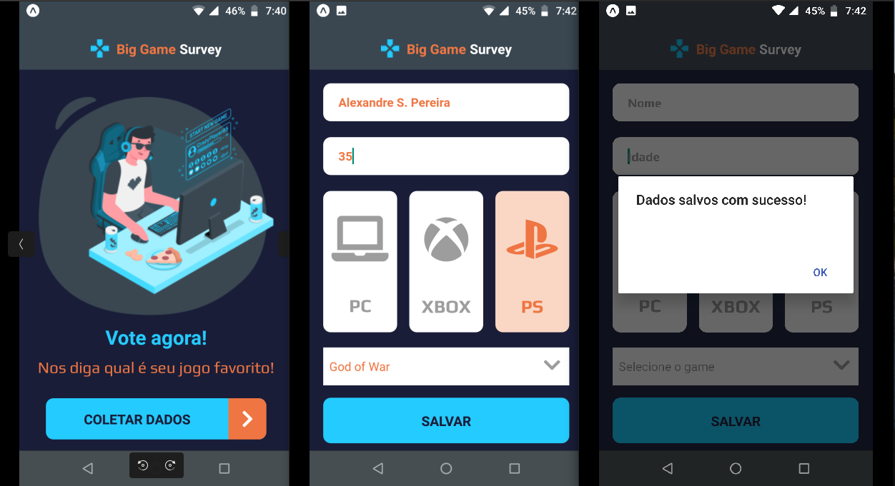
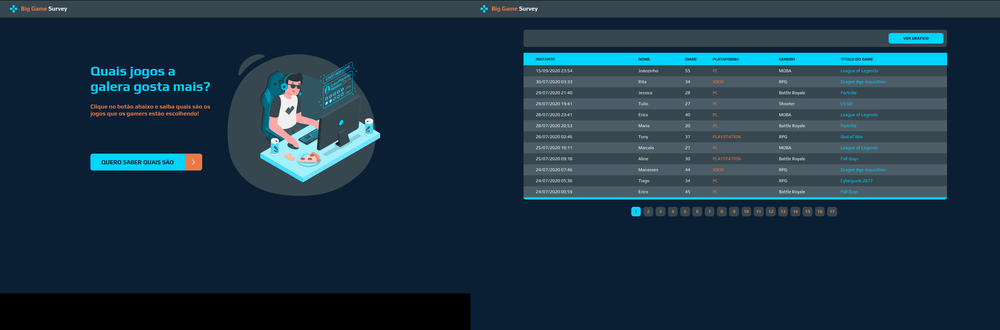
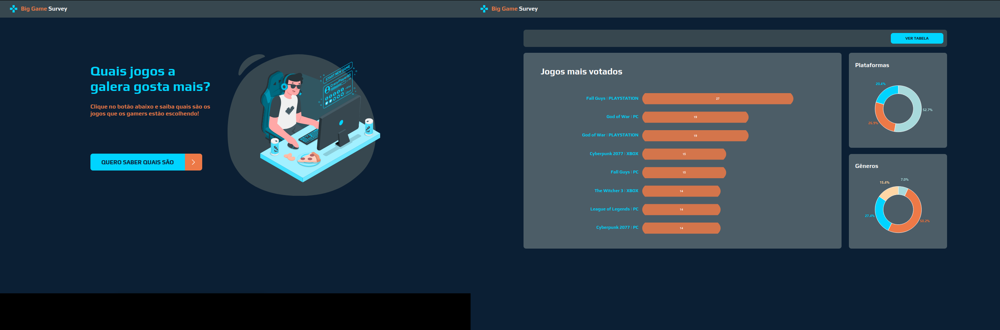

## dsPesquisa é um projeto que foi desenvolvido durante o evento #SemanaDevSuperior.

O objetivo desde projeto é criar aplicação web e móvel de pesquisa de preferência de jogos eletrônicos.

#### As tecnologias utilizada:
Frontend
- ReactJS
- HTML5
- CSS

Backend
- Java
- Spring
- Postgresql

